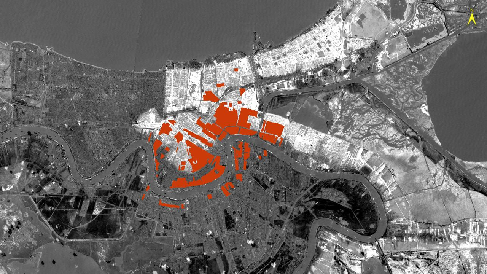

<p align="center">
  
</p>

# EarthExplorer

Testing the use of Google Earth Engine to explore satellite remote sensing data

---

## 🚀 Getting Started

### Prerequisites

To run this project locally, you need:

* Python 3.10 or higher
* A Google Cloud project with Earth Engine and Drive APIs enabled
* `client_secrets.json` from your Google Cloud OAuth credentials
* The following Python packages:

  ```bash
  pip install earthengine-api pydrive2 rasterio numpy
  ```

### Setup Instructions

1. Clone this repository:

   ```bash
   git clone https://github.com/your-username/EarthExplorer.git
   cd EarthExplorer
   ```
2. Place your `client_secrets.json` file in the root folder.
3. Run the main script to authenticate and begin downloading:

   ```bash
   python 1_download.py
   ```
4. Downloaded `.tif` files will be saved in the `data/` folder (ignored by Git).

### Adding the Project Image

To display the remote sensing image at the top of the README:

1. Create a folder named `assets/` in your GitHub repository root directory.
2. Place your image file there (e.g., `cover.png`).
3. Use the following Markdown to embed it at the top:

   ```markdown
   <p align="center">
     
   </p>
   ```

---

## 🤝 How to Contribute

Contributions are welcome! If you'd like to improve the codebase or expand the analysis:

1. Fork the repository
2. Create a new branch:

   ```bash
   git checkout -b feature/your-feature-name
   ```
3. Commit your changes:

   ```bash
   git commit -m "Add your message here"
   ```
4. Push to the branch:

   ```bash
   git push origin feature/your-feature-name
   ```
5. Open a pull request describing what you changed and why

If you’re working with new environmental indicators, please update the `README.md` with the source and purpose of the metric.

---

## 🌎 Variables and Descriptions

### Vegetation and Land Use Indices

| Indicator                                         | Description                                                                                                   | Source                    |
| ------------------------------------------------- | ------------------------------------------------------------------------------------------------------------- | ------------------------- |
| **NDVI (Normalized Difference Vegetation Index)** | Measures vegetation health using `(NIR - Red) / (NIR + Red)`. Values near +1 indicate healthy vegetation.     | Landsat 9 (Bands 5 and 4) |
| **NDWI (Normalized Difference Water Index)**      | Detects surface water using `(Green - NIR) / (Green + NIR)`. Useful for wetland and water mapping.            | Landsat 9 (Bands 3 and 5) |
| **NDBI (Normalized Difference Built-up Index)**   | Identifies built-up areas using `(SWIR - NIR) / (SWIR + NIR)`. Higher values imply more urban infrastructure. | Landsat 9 (Bands 6 and 5) |
| **LST (Land Surface Temperature)**                | Estimates land temperature in Kelvin using `ST_B10 * 0.00341802 + 149.0`.                                     | Landsat 9 Thermal Band 10 |
| **Turbidity Index**                               | A proxy for water turbidity using green reflectance. Higher values may imply suspended solids or algal bloom. | Landsat 9 (Band SR\_B3)   |

---

### Air Quality and Atmospheric Variables

| Indicator                       | Description                                                               | Source                                         |
| ------------------------------- | ------------------------------------------------------------------------- | ---------------------------------------------- |
| **CO (Carbon Monoxide)**        | Indicates combustion-related pollution from vehicles, fires, or industry. | Sentinel-5P (`COPERNICUS/S5P/OFFL/L3_CO`)      |
| **NO₂ (Nitrogen Dioxide)**      | Major urban pollutant linked to traffic and respiratory health concerns.  | Sentinel-5P (`COPERNICUS/S5P/OFFL/L3_NO2`)     |
| **OZONE (O₃ Column)**           | Measures tropospheric ozone; ground-level ozone is harmful to health.     | Sentinel-5P (`COPERNICUS/S5P/OFFL/L3_O3`)      |
| **AOD (Aerosol Optical Depth)** | Indicates airborne particulate concentration; used as a proxy for PM2.5.  | MODIS (`MODIS/006/MCD19A2_Optical_Depth_Land`) |

---

### Infrastructure and Activity

| Indicator                       | Description                                                                                  | Source                                           |
| ------------------------------- | -------------------------------------------------------------------------------------------- | ------------------------------------------------ |
| **Nighttime Lights (Radiance)** | Reflects infrastructure, human presence, and economic activity using visible light at night. | VIIRS-DNB (`NOAA/VIIRS/DNB/MONTHLY_V1/VCMSLCFG`) |

---

### Notes on Data

* **Temporal Scope:** All variables are monthly means or medians.
* **Spatial Resolution:** 30m (Landsat); 1–7km (MODIS, Sentinel-5P).
* **Caveats:** Cloud cover, atmospheric conditions, and sensor differences can introduce bias. Use QA masks when possible.

## 🌱 Potential Indicators for Expansion

These are additional spatial indicators under consideration to enhance linkage with the Child Opportunity Index (COI). Most are available from public satellite data via Google Earth Engine and can be computed monthly and at high resolution.

### 🌊 Hydrologic & Environmental Hazards

| Indicator         | Description                                           | GEE Source(s)                               |
| ----------------- | ----------------------------------------------------- | ------------------------------------------- |
| **Flood Risk**    | Persistent surface water changes or flood-prone zones | `JRC/GSW1_3/MonthlyHistory`, Sentinel-1 SAR |
| **Fire Risk**     | Burned areas and active fire events                   | `MODIS/MCD64A1`, `FIRMS`, `VIIRS`           |
| **Drought Index** | Evapotranspiration or soil moisture anomalies         | `MOD16A2`, `NASA/SMAP/SPL3SMP`              |

---

### 🌡️ Climate Stressors

| Indicator               | Description                                              | Method / Source                      |
| ----------------------- | -------------------------------------------------------- | ------------------------------------ |
| **Temperature Anomaly** | Monthly LST deviation from 10-year climatology           | MODIS LST (`MOD11A2`) or Landsat LST |
| **Urban Heat Index**    | Combine high LST + low albedo to flag heat vulnerability | `MODIS/MCD43A3` + LST                |

---

### 🌫️ Atmospheric Pollution & Exposure

| Indicator    | Description                                   | GEE Source                    |
| ------------ | --------------------------------------------- | ----------------------------- |
| **UV Index** | Potential UV exposure at surface              | `COPERNICUS/S5P/OFFL/L3_UVAI` |
| **SO₂**      | Sulfur dioxide, linked to industrial activity | `COPERNICUS/S5P/OFFL/L3_SO2`  |
| **CH₄**      | Methane, from landfills, agriculture, etc.    | `COPERNICUS/S5P/OFFL/L3_CH4`  |

---

### 🏔️ Terrain & Elevation

| Indicator          | Description                                  | GEE Source / Method               |
| ------------------ | -------------------------------------------- | --------------------------------- |
| **Elevation**      | Absolute elevation in meters above sea level | `USGS/SRTMGL1_003`, `MERIT DEM`   |
| **Slope**          | Degree of terrain steepness                  | Derived from DEM with `terrain()` |
| **Sea Level Risk** | Tracts below flood-prone elevation threshold | Elevation mask + flood layers     |

---

> These metrics support analyses of environmental injustice, child health disparities, urban heat vulnerability, and disaster resilience across U.S. census tracts. Future development phases will test and integrate select indicators into the broader COI framework.
